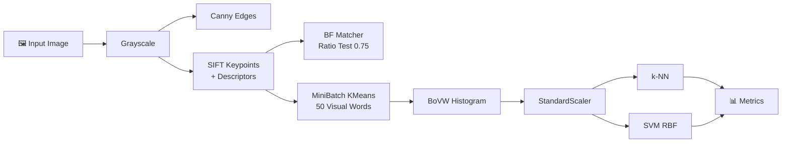

<div align="center">

# 🔍 Feature Detection & Image Classification

### Classical Computer Vision with **Canny · SIFT · Bag of Visual Words · SVM**

*From raw pixels to animal recognition, no deep learning required.*

<br>


<br>

[Overview](#-overview) •
[Pipeline](#-pipeline) •
[Results](#-results) •
[Getting Started](#-getting-started) •
[Tech Stack](#-tech-stack) •
[Author](#-author)

</div>

---

## 📖 Overview

This project walks through the **full classical computer vision workflow** in a single notebook:

1. **Detect** edges and keypoints in an image.
2. **Match** features between an image and a rotated, scaled copy of itself.
3. **Classify** animals using handcrafted features and traditional ML models.

It shows how far hand-engineered features (SIFT descriptors aggregated into a **Bag of Visual Words**) can go when paired with a well-tuned **Support Vector Machine**.

> 💡 **Why classical CV?** It is fast, interpretable, and needs no GPU. It is also the foundation that modern deep learning approaches build on.

---

## ✨ Highlights

| | Feature | Description |
|---|---|---|
| 🧱 | **Edge Detection** | Canny edge maps with hysteresis thresholds (100, 200) |
| 🎯 | **Keypoint Detection** | SIFT keypoints with 128-D descriptors |
| 🔗 | **Feature Matching** | Brute-force kNN matcher with Lowe's ratio test (0.75) |
| 🧩 | **Bag of Visual Words** | MiniBatchKMeans vocabulary of 50 visual words |
| 🤖 | **Classification** | k-NN baseline vs. RBF-kernel SVM |
| 📊 | **Evaluation** | Accuracy, Precision, Recall, F1, confusion matrices |

---

## 🗺️ Pipeline



---

## 🧪 Tasks

<details open>
<summary><b>Task 1 · Edge Detection (Canny)</b></summary>

<br>

A single cat image is rotated by **25°** and scaled to **0.85×** to simulate a different viewpoint of the same object. Canny edge detection is applied to both versions.

- Thresholds: `(100, 200)`
- Output: `task1_edges.png`

</details>

<details open>
<summary><b>Task 2 · Keypoint Detection (SIFT)</b></summary>

<br>

SIFT finds scale- and rotation-invariant keypoints in both images.

| Image | Keypoints | Descriptor Shape |
|:--|:--:|:--:|
| Original | **502** | `(502, 128)` |
| Rotated + Scaled | **405** | `(405, 128)` |

Output: `task2_keypoints.png`

</details>

<details open>
<summary><b>Task 3 · Feature Matching</b></summary>

<br>

A brute-force matcher with `k=2` nearest neighbours, filtered by **Lowe's ratio test** (`0.75`), keeps only distinctive matches.

**✅ 281 good matches** were found despite the rotation and scale change, which shows SIFT's invariance.

Output: `task3_matches.png`

</details>

<details open>
<summary><b>Task 4 · Bag of Visual Words + Classification</b></summary>

<br>

1. Load **Bear** and **Zebra** images (up to 130 per class), resized to `200×200`.
2. Split 80/20, stratified (`random_state=42`).
3. Extract SIFT descriptors from every image.
4. Cluster all training descriptors into **50 visual words** with `MiniBatchKMeans`.
5. Encode each image as a normalized 50-bin histogram.
6. Standardize features with `StandardScaler`.
7. Train **k-NN** and **SVM (RBF, C=50, gamma='scale')**.

**Dataset:** 255 images across 2 classes, selected from a 15-class animal dataset.

</details>

<details open>
<summary><b>Task 5 · Evaluation</b></summary>

<br>

Both models are scored with weighted Accuracy, Precision, Recall, and F1, with confusion matrices saved to `task5_confusion_matrices.png`.

</details>

---

## 📈 Results

<div align="center">

| Model | Accuracy | Precision | Recall | F1-Score |
|:--|:--:|:--:|:--:|:--:|
| **k-NN** | 0.6863 | 0.6863 | 0.6863 | 0.6863 |
| **SVM (RBF)** 🏆 | **0.8431** | **0.8638** | **0.8431** | **0.8413** |

</div>

**Key takeaways**

- 🏆 The **SVM beats k-NN by about 15.7 percentage points** in accuracy (0.8431 vs 0.6863).
- 🎨 Bear and Zebra were chosen as *visually distinct* classes (zebra stripes give very characteristic SIFT features).
- 📉 k-NN struggles in the standardized 50-D histogram space, while the RBF kernel captures non-linear class boundaries better.

---

## 🚀 Getting Started

### Option 1: Google Colab (recommended)

1. Open `Feature_Detection_Muhammad_Furqan_.ipynb` in [Google Colab](https://colab.research.google.com/).
2. Run the first cell to install dependencies.
3. When prompted, upload your `archive.zip` dataset.
4. Run all cells (`Runtime → Run all`).

### Option 2: Local Setup

```bash
# Clone the repository
git clone https://github.com/<your-username>/<your-repo>.git
cd <your-repo>

# Install dependencies
pip install opencv-contrib-python scikit-learn scikit-image matplotlib numpy jupyter

# Launch the notebook
jupyter notebook Feature_Detection_Muhammad_Furqan_.ipynb
```

> ⚠️ The notebook uses `google.colab.files` for upload and download. When running locally, replace those calls by placing the dataset in the working directory.

---

## 📂 Dataset Structure

The notebook expects `archive.zip` to extract to an `animal_data/` folder with one sub-folder per class:

```
animal_data/
├── Bear/        (125 images)
├── Bird/        (137 images)
├── Cat/         (123 images)
├── Cow/         (131 images)
├── Deer/        (127 images)
├── Dog/         (122 images)
├── Dolphin/
├── Elephant/
├── Giraffe/
├── Horse/
├── Kangaroo/
├── Lion/
├── Panda/
├── Tiger/
└── Zebra/
```

---

## 📦 Generated Outputs

| File | Description |
|:--|:--|
| `task1_edges.png` | Canny edge maps of both images |
| `task2_keypoints.png` | SIFT keypoints visualization |
| `task3_matches.png` | Feature matches between the image pair |
| `task5_confusion_matrices.png` | k-NN vs SVM confusion matrices |
| `metrics_report.txt` | Final metrics summary |

---

## 🛠️ Tech Stack

| Category | Tools |
|:--|:--|
| **Language** | Python |
| **Computer Vision** | OpenCV (`opencv-contrib-python`) |
| **Machine Learning** | scikit-learn (`SVC`, `KNeighborsClassifier`, `MiniBatchKMeans`) |
| **Numerics** | NumPy |
| **Visualization** | Matplotlib |
| **Environment** | Jupyter / Google Colab |

---

## 🔮 Future Improvements

- [ ] Extend classification to all **15 animal classes**
- [ ] Tune vocabulary size (`n_clusters`) and SVM hyperparameters with `GridSearchCV`
- [ ] Compare SIFT against **ORB / AKAZE** descriptors
- [ ] Add **HOG** or color-histogram features
- [ ] Benchmark against a CNN baseline

---

## 🤝 Contributing

Contributions, issues, and feature requests are welcome. Feel free to open an issue or submit a pull request.

---

## 👤 Author

<div align="center">

**Muhammad Furqan**

[](https://github.com/)
[](https://linkedin.com/)

</div>

---

<div align="center">

⭐ **If you found this project useful, consider giving it a star!** ⭐

*Built with OpenCV, scikit-learn, and curiosity.*

</div>
